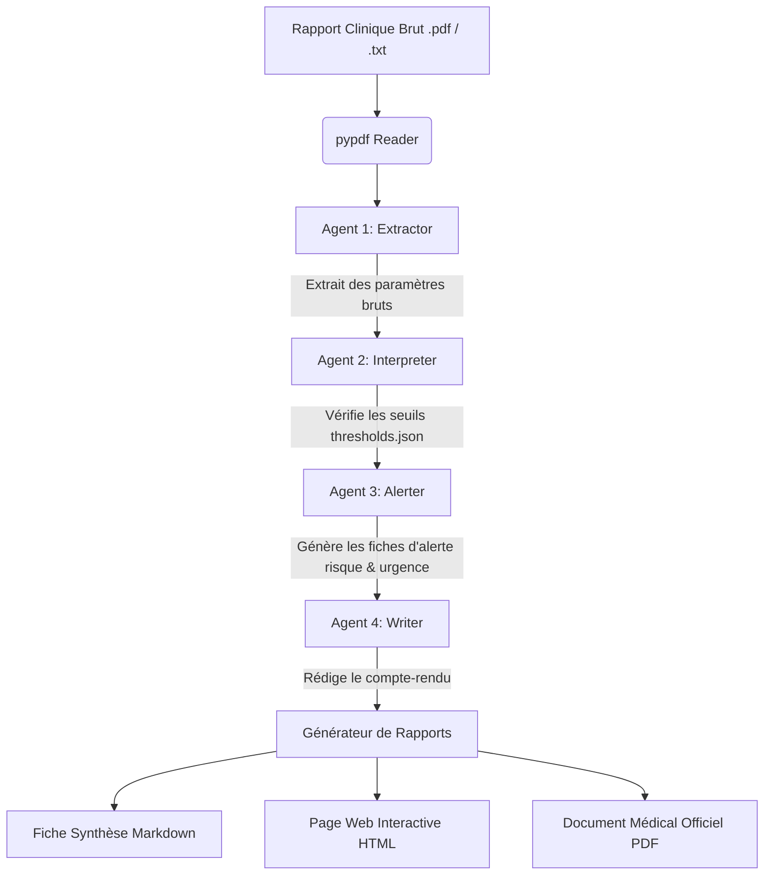

# 🧬 MedAgent — Assistant Médical Multi-Agent d'Aide à la Décision

MedAgent est une plateforme d'analyse biologique et clinique automatisée de qualité professionnelle. Elle utilise un orchestre d'agents intelligents pour extraire les paramètres biologiques de rapports cliniques (PDF/TXT), les confronter à des normes médicales rigoureuses, générer des alertes de criticité et rédiger une synthèse clinique d'urgence.

---

## 🏗️ Architecture du Système

MedAgent repose sur une chaîne d'exécution multi-agent séquentielle et hautement découplée :



---

## 🛡️ Résilience et Architecture LLM Multi-Niveaux (Fallback)

Pour garantir une disponibilité totale (100% de réussite) même en environnement contraint ou déconnecté, la couche d'accès LLM (`llm/model.py`) est conçue avec une architecture résiliente à quatre niveaux :

1. **Serveur BitNet Local (Docker)** : Option principale basse consommation utilisant un modèle quantifié ultra-léger 1-bit (`bitnet-b1.58-2b-4t`).
2. **API Google Gemini (Cloud)** : Première bascule automatique en ligne si configurée via `GEMINI_API_KEY`.
3. **API OpenAI (Cloud)** : Seconde bascule automatique si configurée via `OPENAI_API_KEY`.
4. **Moteur d'Heuristique Clinique Local (Mock IA)** : Ultime secours intelligent basé sur des expressions régulières cliniques avancées et le référentiel de seuils locaux. Ce moteur garantit que l'analyse s'exécute avec brio sans aucune connexion réseau et sans serveur actif.

---

## 🚀 Fonctionnalités Clés

* **Lecture Multi-Format** : Parseur de fichiers texte et de documents `.pdf` scannés ou électroniques.
* **Seuils Cliniques Dynamiques** : Base de connaissances de référence (`config/thresholds.json`) structurée par catégories (Hématologie, Biochimie, Enzymes Cardiaques, Coagulation, etc.) prenant en compte le genre (Masculin, Féminin, Défaut) et la criticité.
* **Tableau de Bord Streamlit Haut de Gamme** :
  * Processus multi-agent animé et transparent.
  * Graphiques analytiques interactifs des écarts aux normes.
  * Cartes de gravité dynamiques (urgences critiques signalées en clignotement rouge).
  * Système d'historique local permettant de charger, comparer et recharger les analyses passées.
* **Génération Multi-Format Directe** : Production automatique de rapports au format Markdown propre, HTML responsive de haute qualité esthétique et PDF officiel signé.
* **Traitement CLI & Par Lot (Batch)** : Traitement en une commande d'un répertoire entier de rapports médicaux.

---

## 🔧 Installation & Configuration

### 1. Prérequis

* Python 3.10 ou supérieur
* (Optionnel) Docker et Docker Compose si vous souhaitez faire tourner le serveur local de calcul 1-bit.

### 2. Installation des dépendances

```bash
pip install -r requirements.txt
```

### 3. Variables d'environnement

Copiez le fichier d'exemple et configurez vos clés ou préférences :

```bash
cp .env.example .env
```

---

## 💻 Guide d'Utilisation

### Mode 1 : Console Web Interactive (Streamlit)

Lancez l'interface graphique interactive dans votre navigateur :

```bash
streamlit run app.py
```
*L'application s'ouvre d'elle-même. Vous pouvez glisser-déposer vos PDF ou tester instantanément à l'aide du bouton **Charger le rapport type**.*

### Mode 2 : Ligne de Commande CLI

Pour analyser un rapport unique :
```bash
python main.py --file data/reports/report_01.txt --format all
```

Pour analyser un dossier complet de rapports (traitement par lot) :
```bash
python main.py --dir data/reports/ --output-dir output/summaries/
```

---

## 🧪 Tests de Qualité

Une suite complète de tests unitaires et d'intégration validant le parseur, le système d'alertes cliniques, le checker de seuils et le fallback LLM est disponible. Exécutez-les simplement avec :

```bash
pytest test/test_medagent.py
```
